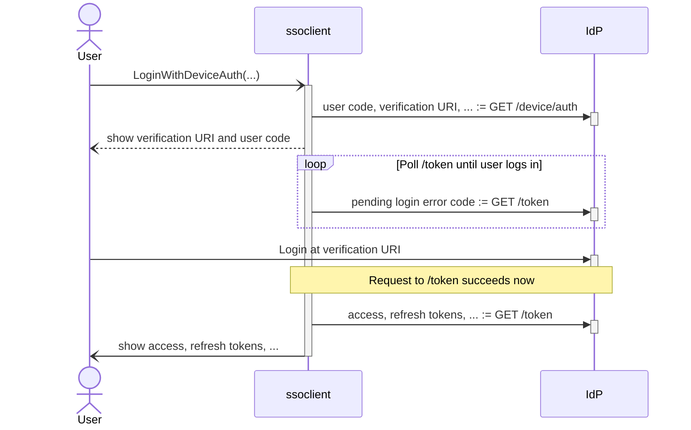
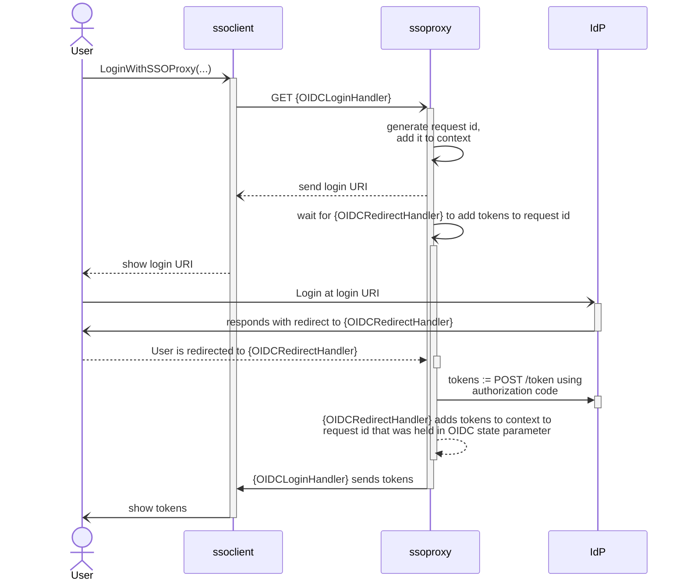

# Go Single Sign-On for Console applications


This project provides SSO functionality for console applications. Currently, 2 authentication methods are supported:

- [OAuth 2.0 Device Authorization Grant](https://datatracker.ietf.org/doc/html/rfc8628).
- [OpenID Connect Authorization Code Flow](https://openid.net/specs/openid-connect-core-1_0.html#CodeFlowAuth)

These methods require usage of at least one of the two provided libraries **ssoproxy** and **ssoclient**.

### OAuth 2.0 Device Authorization Grant

For this method only **ssoclient** is needed. The disadvantage of using this method is that client id will need to be passed to the CLI application. This parameter will probably be retrieved from user's config file or command flags. Either way it will be known to the user. Polling the IdP can also lead to slower logins if there is a long polling interval set in the IdP. The authentication process is illustrated in the following diagram:



### OpenID Connect Authorization Code Flow

This method requires usage of **ssoclient** and **ssoproxy**. The proxy provides 2 HTTP handlers - OIDCLoginHandler and OIDCRedirectHandler. These handlers must exposed from the Go server using this library.

- If you are already running your own utility Go server, exposing these handlers should be trivial, just create a **shared** OIDCContext (provided by ssoproxy) and pass it to both handlers
- If you are running your own utility server in another language, consider running a simple Go binary on the same server on a different port
- If you are not running a utility server, the easiest way to start is to deploy `./examples/proxy` using the provided `Dockerfile`.

Under the hood **ssoproxy** uses _HTTP text/event-stream_ and _Server-Sent Events_ format for asynchronous communication with **ssoclient** and by this achieves that no polling is needed.

The authentication process is illustrated in the following diagram:



The following parameters can be configured on _OIDC context_:

- `Logger` - logger for HTTP handlers, does not log any messages by default
- `SuccessRedirectURI` - if set users will be redirected to it after login to IdP if the redirect processing was successful
- `FailedRedirectURI` - if set users will be redirected to it after login to IdP if the redirect processing failed
- `LoginTimeout` - time for user to login to IdP after login was initiated, default 5 minutes

### Example

```bash
# This example needs a Keycloak instance running in the same docker network on port 8080 with container name 'keycloak'
# Example Keycloak config can be found in e2e-tests/docker-compose.yaml
docker build ./examples/proxy -t clisso/proxy:latest
# Hosts must be set correctly, when --network=host isn't used (localhost in container isn't localhost on host)
# - base URI: is accessed from SSO Proxy -> use container name ('keycloak')
# - redirect URI: is set to 'Location' header when keycloak redirects after login -> interpreted by the browser -> localhost
# - authorization URI: is accessed from the browser -> localhost
docker run --rm -it -p '8000:8000' \
  -env HTTP_PORT=8000 \
  -env OIDC_BASE_URI="http://keycloak:8080/realms/test/protocol/openid-connect" \
  -env OIDC_REDIRECT_URI="http://localhost:8000/cli-logged-in" \
  -env OIDC_AUTHORIZATION_URI="http://localhost:8080/realms/test/protocol/openid-connect/auth?response_type=code&scope=openid&client_id=test&redirect_uri=http://localhost:8000/cli-logged-in" \
  -env OIDC_CLIENT_ID=test \
  -env OIDC_CLIENT_SECRET=YscDX1J39s7PDBbpBJWsGyOLdl8TJEUK

go run ./examples/cli/main.go login \
  -grant code \
  -login-uri "http://localhost:8000/cli-login"
# TODO: show example output - login uri and result
go run ./examples/cli/main.go login \
  -grant device \
  -oidc-uri "http://localhost:8080/realms/test/protocol/openid-connect/token" \
  -client-id test
# TODO: show example output - login uri, usercode and result
```

#### Features that need to be implemented before v1:

- [x] write tests for ssoclient
- [x] e2e test with keycloak and vault
- [ ] e2e test with different IdP (not keycloak, maybe dex?)
- [x] CI - test ssoproxy(+coverage), ssoclient(+coverage), e2e_tests
- [x] refactor and write doc strings
- [x] README.md - **info**, **install**, how to use, show coverage
- [x] refactor CLI example and proxy example
- [x] cleanup/remove local/ directory
